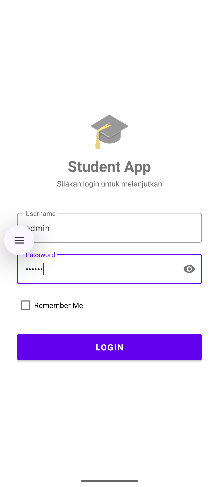
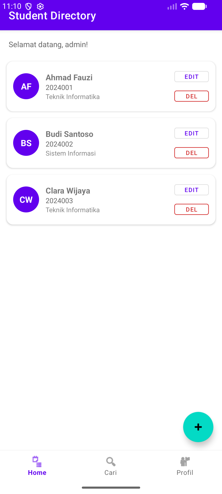
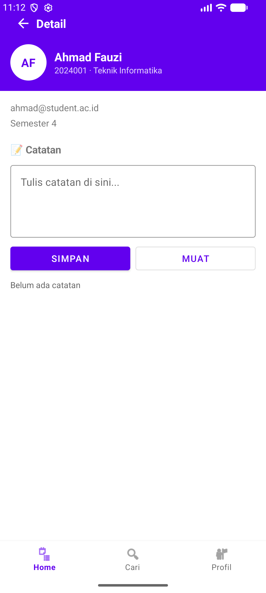
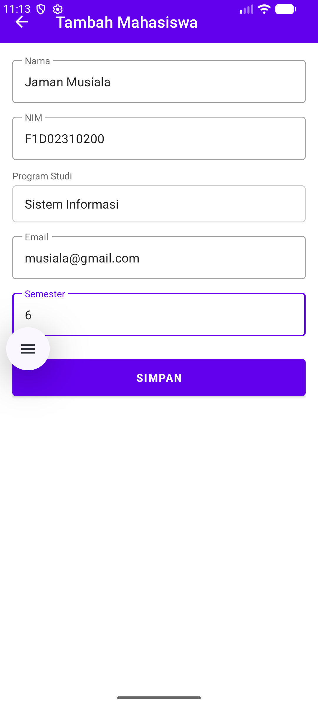

# 📱 Student Contact App

> Aplikasi manajemen data mahasiswa berbasis Android dengan fitur pencarian, catatan per mahasiswa, dan penyimpanan lokal.

---

## 👤 Identitas

**Nama**  : Muhammad Ridho Aidil Furqon

**NIM**  : F1D02310127

---

## 📝 Deskripsi Aplikasi

**Student Contact App** adalah aplikasi Android yang memungkinkan pengguna untuk mengelola data kontak mahasiswa secara lokal. Aplikasi ini dilengkapi dengan sistem autentikasi sederhana, CRUD data mahasiswa, pencarian, serta fitur catatan pribadi per mahasiswa yang disimpan dalam file internal.

### Fitur Utama:
- 🔐 **Login** dengan validasi username & password, dilengkapi opsi *Remember Me*
- 🏠 **Daftar Mahasiswa** dengan RecyclerView, swipe-to-delete, dan data sampel otomatis
- 🔍 **Pencarian** mahasiswa berdasarkan nama atau NIM secara real-time
- 📋 **Detail Mahasiswa** lengkap dengan avatar inisial dan informasi akademik
- 📝 **Catatan per Mahasiswa** — tulis, simpan, dan muat catatan ke file internal
- ➕ **Tambah / Edit** data mahasiswa melalui form yang tervalidasi
- 👤 **Profil** pengguna yang sedang login
- 📂 **Daftar Catatan** — lihat semua file catatan yang tersimpan

---

## 📸 Screenshot

### 1. Halaman Login


### 2. Daftar Mahasiswa


### 3. Detail Mahasiswa


### 4. Form Tambah


---

## 🗄️ Metode Penyimpanan

Aplikasi ini menggunakan **dua metode penyimpanan** yang berbeda sesuai kebutuhan data:

### 1. Room Database (SQLite)
Digunakan untuk menyimpan **data mahasiswa** (nama, NIM, prodi, email, semester).

**Alasan dipilih:**
- Data mahasiswa bersifat terstruktur dan relasional
- Mendukung query SQL seperti pencarian (`LIKE`) dan pengurutan (`ORDER BY`)
- Terintegrasi dengan Kotlin Coroutines dan Flow untuk pembaruan UI secara reaktif
- Lebih efisien dibanding menyimpan banyak data ke SharedPreferences

### 2. Internal File Storage
Digunakan untuk menyimpan **catatan teks per mahasiswa** dalam file `note_[NIM].txt`.

**Alasan dipilih:**
- Catatan bersifat teks bebas (tidak terstruktur), tidak cocok untuk tabel database
- File internal hanya bisa diakses oleh aplikasi sendiri, sehingga lebih aman
- Mudah dikelola: `openFileOutput()`, `openFileInput()`, `deleteFile()`
- Nama file mengandung NIM sehingga mudah diidentifikasi dan di-listing

### 3. SharedPreferences
Digunakan untuk menyimpan **sesi login** (username, status login, opsi remember me).

**Alasan dipilih:**
- Data sesi berupa pasangan key-value sederhana (Boolean, String)
- Akses cepat tanpa perlu query database
- Cocok untuk data konfigurasi dan preferensi pengguna

---

## 🚧 Kendala & Solusi

### 1. Kotlin Version Mismatch
**Kendala:** Build gagal dengan error `Provided Metadata instance has version 2.1.0, while maximum supported version is 2.0.0`. Library `core-ktx:1.18.0` dan `activity:1.13.0` dikompilasi dengan Kotlin 2.1, sedangkan proyek masih menggunakan Kotlin 1.9.22.

**Solusi:** Update versi Kotlin di `libs.versions.toml`:
```toml
kotlin = "2.1.20"
```

---

### 2. Aplikasi Crash Saat Membuka Detail Mahasiswa
**Kendala:** Saat nama mahasiswa ditekan, aplikasi langsung keluar (crash). Penyebabnya adalah `HomeFragment` menggunakan `parentFragmentManager.beginTransaction().replace(R.id.nav_host_fragment, ...)` secara manual, yang tidak diizinkan pada container yang dikelola oleh Navigation Component.

**Solusi:** Pindah ke `NavController` dengan menambahkan `<action>` dan `<argument>` di `nav_graph.xml`, lalu menggunakan:
```kotlin
findNavController().navigate(
    R.id.action_home_to_detail,
    bundleOf("studentId" to student.id)
)
```

---

### 3. Layar Hitam di Emulator
**Kendala:** Emulator API 36 menampilkan layar hitam setelah build berhasil.

**Solusi:** API 36 masih sangat baru dan rendering-nya bermasalah di beberapa mesin. Solusinya dengan menggunakan emulator **API 33 atau 34**, atau melakukan *Cold Boot* dan mengganti renderer GPU ke `SwANGLE` di pengaturan emulator.

---

### 4. File `item_note.xml` Tidak Ada
**Kendala:** Build error karena `NoteListAdapter` mereferensikan `ItemNoteBinding` yang berasal dari `item_note.xml`, namun file tersebut belum dibuat.

**Solusi:** Membuat file `res/layout/item_note.xml` sebagai layout item untuk RecyclerView daftar catatan.

---

```
